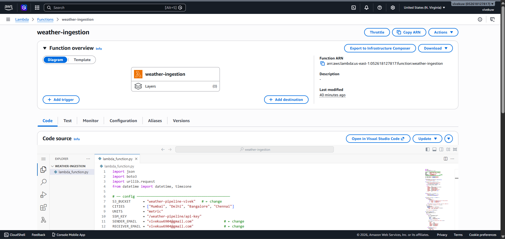
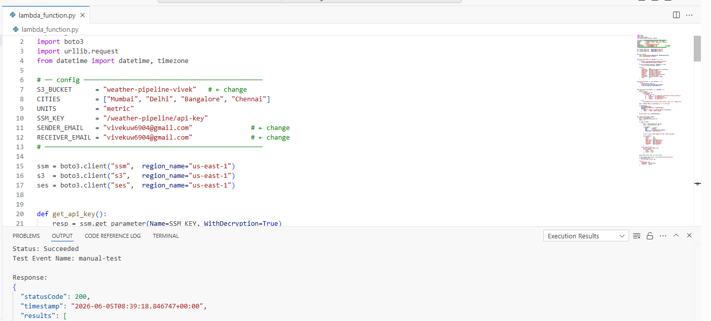
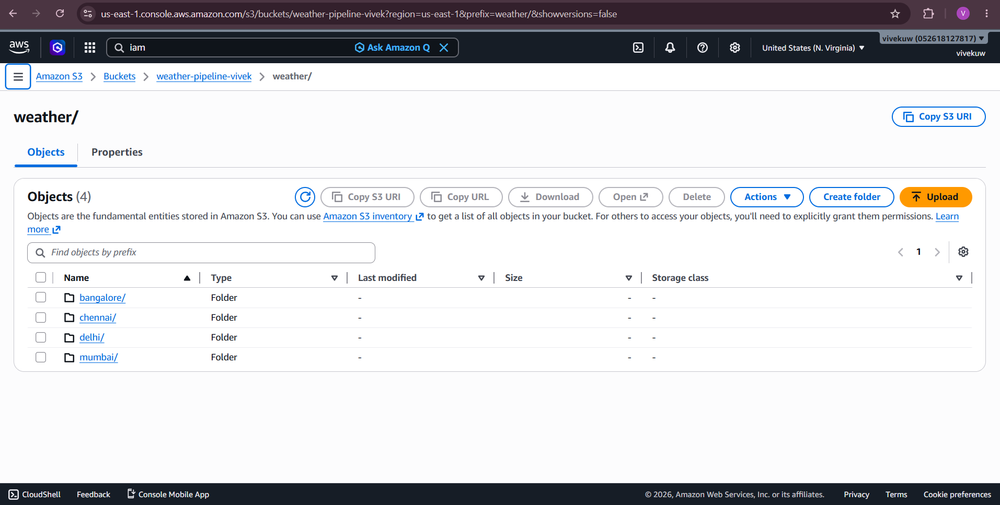
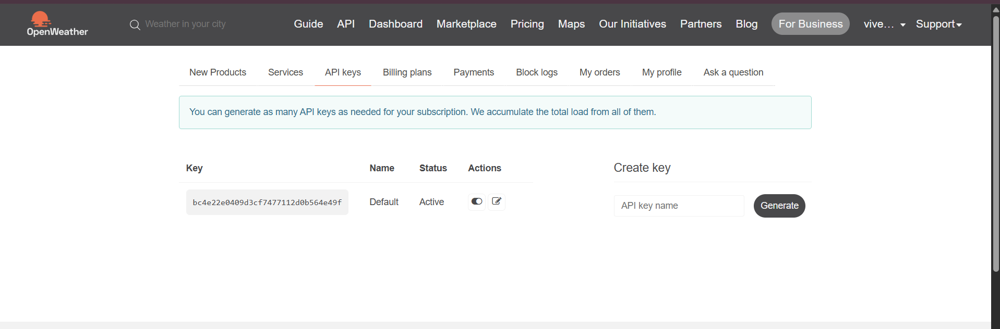
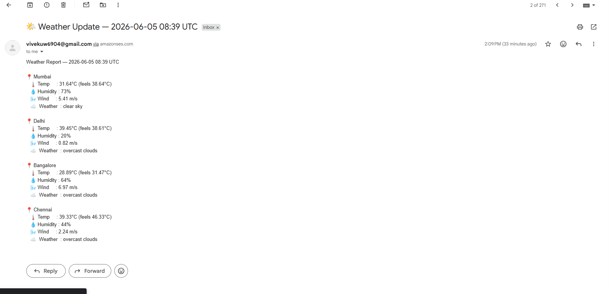

# 🌤 AWS Weather Data Pipeline

Automated serverless pipeline that fetches real-time weather data
for 4 Indian cities every hour and sends email summary.

## 🏗 Architecture

EventBridge (hourly) → Lambda (Python) → OpenWeatherMap API → S3 → SES Email

## ⚙️ AWS Services Used

| Service | Purpose |
|---|---|
| AWS Lambda | Fetch weather + save to S3 + send email |
| Amazon EventBridge | Trigger Lambda every hour (cron) |
| Amazon S3 | Store hourly JSON files (date-partitioned) |
| AWS SES | Send hourly weather summary email |
| AWS SSM Parameter Store | Store API key securely |
| AWS IAM | Least-privilege role for Lambda |
| Amazon CloudWatch | Logs + error monitoring |

## 📸 Screenshots

### Lambda Function

### EventBridge Schedule

### Python Code

### S3 Bucket Structure

### IAM Role

### OpenWeatherMap API

### Email Output

## 📁 S3 Data Structure
